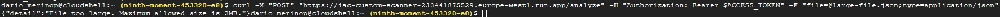

# IaC Custom Scanner

This is a FastAPI-based application that analyzes security vulnerabilities in Kubernetes manifest and Infrastructure as Code (IaC) JSON files.

## Features

Detects security misconfigurations in Kubernetes manifest.

Identifies potential security risks in IaC resources.

Provides remediation recommendations following CIS best practices.

## Installation

### Requirements

* Python 3.10+
* FastAPI
* Uvicorn
* Pydantic 
* Typing
* Python-multipart

### Install Dependencies

To install the necessary dependencies, run:

```pip install -r requirements.txt```

## Usage

### Running Locally

To run the application locally, use the following command:

```uvicorn app.main:app --host 0.0.0.0 --port 8080```

The application will be available at http://localhost:8080.

### API Endpoint

* POST /analyze: Upload a JSON file containing a Kubernetes manifest or an IaC configuration for analysis.

CLI example with **curl**:

```curl -X POST "http://127.0.0.1:8080/analyze" -F "file=@test.json;type=application/json"```

Example Output:

```
**Issue**: Using 'default' namespace
**Severity**: MEDIUM
**Explanation**: Using the 'default' namespace can lead to segregation and security issues.
**Remediation**: Use a specific namespace for each application and apply RBAC controls.

**Issue**: Secret exposed in environment variable: SECRET_KEY
**Severity**: HIGH
**Explanation**: Credentials should not be stored in environment variables as they may be leaked in logs or extracted by attackers.
**Remediation**: Use a secret manager like AWS Secrets Manager, HashiCorp Vault, or Kubernetes Secrets.
```

## Deploying to Google Cloud Run

This application is optimized for deployment on Google Cloud Run, and secured using Cloud IAM access control, ensuring scalability, security, and cost efficiency within the GCP Free Tier.

### Prerequisites

1. A Google Cloud Project with Billing enabled
2. Install the Google Cloud SDK (if you are not using Cloud Shell in GCP)
3. Docker installed (if building locally)
4. The following GCP services enabled:
```
gcloud services enable run.googleapis.com \
    cloudbuild.googleapis.com \
    artifactregistry.googleapis.com \
```

5. Authenticate with GCP:

```
gcloud auth login
gcloud config set project [PROJECT_ID]
```
Replace [PROJECT_ID] with your GCP project ID
### Deployment Steps

#### Create Artifact Registry (if you don't have one)
Cloud Run requires a container image stored in a registry to deploy the application.

```gcloud artifacts repositories create [REPO_NAME] --repository-format=docker --location=[REGION]```

Replace [REPO_NAME] and [REGION] with the name you want for your repository and desired region.
#### Build and Push Docker Image
First, you need to configure Docker to authenticate with Google Artifact Registry in the specified region:

```gcloud auth configure-docker [REGION]-docker.pkg.dev```


To build and push the Docker image, run:

```
docker build -t [REGION]-docker.pkg.dev/[PROJECT_ID]/[REPO_NAME]/iac-custom-scanner:v1 .
docker push [REGION]-docker.pkg.dev/[PROJECT_ID]/[REPO_NAME]/iac-custom-scanner:v1
```

Replace [PROJECT_ID], [REPO_NAME] and [REGION] with your GCP project ID, the name you want for your repository and desired region.

#### Deploy to Cloud Run
deploy the application to Cloud Run, use the following command:

```
gcloud run deploy iac-custom-scanner \
  --image [REGION]-docker.pkg.dev/[PROJECT_ID]/[REPO_NAME]/iac-custom-scanner:v1 \
  --platform managed \
  --region [REGION] \
  --no-allow-unauthenticated
 ```

#### Accessing the Service

Once deployed, Cloud Run will provide a URL where the service can be accessed.

To allow a specific user to access the app:
```
gcloud run services add-iam-policy-binding iac-custom-scanner \
    --member=user:user-email@example.com \
    --role=roles/run.invoker
    --region [REGION]
```
#### Authenticating with a Token to Test the App Using curl
First, make sure you are authenticated with Google Cloud using the gcloud command-line tool. Run the following command to authenticate with your Google account:

```gcloud auth login```

After successfully logging in, you need to obtain an access token for authentication. To get the token, run the following command:

```ACCESS_TOKEN=$(gcloud auth print-identity-token)```

This command will output a Bearer token that you can use for the Authorization header in your curl request.

```curl -X "POST" "https://YOUR_URL/analyze" -H "Authorization: Bearer $ACCESS_TOKEN" -F "file=@path_to_your_file/test.json;type=application/json"```

#### Handling Access Issues
If you receive a 403 Forbidden error, it means the user does not have the appropriate permissions. Ensure that the user is granted the roles/run.invoker permission for the service. This can be checked and modified by the Google Cloud project administrator.

## Examples
* Scanning a valid JSON (Example 1 Kubernetes manifest)


* Scanning a valid JSON (Example 2 IAC)


* Security Exception 1: JSON too deep


* Security Exception 2: JSON too large



* Security Exception 3: JSON with no valid format


* Security Exception 4: No JSON file (invalid)


## ANNEX: Security Policies
### Kubernetes manifest
1. Using 'default' namespace. Severity **MEDIUM**
2. Secret exposed in environment variable. Severity **CRITICAL**
3. Storage bucket publicly exposed. Severity **HIGH**
4. Container running with elevated privileges or as root. Severity **HIGH**

### IaC templates
1. Virtual machine has port TCP 22 (SSH) open. Severity **HIGH**
2. Virtual machine has port TCP 3389 (RDP) open. Severity **HIGH**
3. Resource exposes a plaintext password. Severity **CRITICAL**
4. Virtual machine uses a weak password. Severity **HIGH**
5. Virtual machine does not have encryption enabled. Severity **MEDIUM**
6. Users with access to Virtual Machine do not have multi-factor authentication (MFA) enabled. Severity **HIGH**
7. Storage account does not have encryption enabled. Severity **HIGH**
8. Storage account use Locally Redundant Storage (LRS). Severity **MEDIUM**
9. Database has an open insecure port. Severity **HIGH**
10. Database has a weak password. Severity **HIGH**
11. Database does not have encryption enabled. Severity **MEDIUM**
12. Database does not have multi-factor authentication (MFA) enabled. Severity **HIGH**

## License

This project is open source. Usage is allowed, but redistribution or modification should follow open-source principles.
